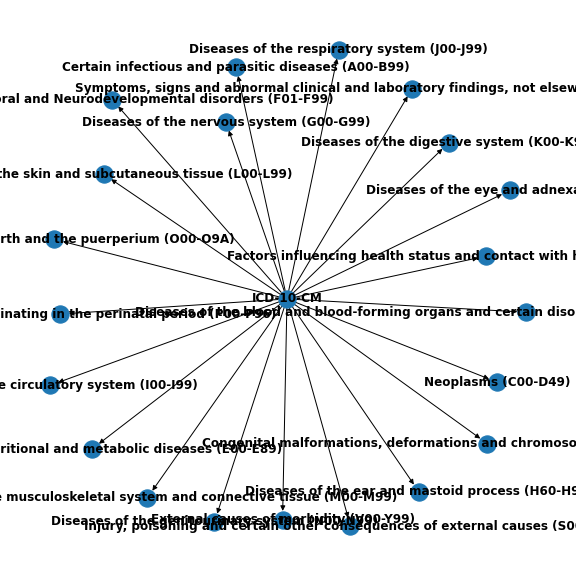

# Usage

## `networkx` hierarchy

To get the `networkx` hierarchy:

```python
from icdcodex import hierarchy
icd_10_cm_hierarchy, icd_10_cm_codes = hierarchy.icd10cm("2020")
```

To visualize at least a portion of the hierarchy:

```python
import networkx as nx
G = nx.relabel_nodes(G, {"root": "ICD-10-CM"})
G_chapters = bfs(G, "ICD-10-CM", depth_limit=1)
plt.figure(figsize=(8,8))
nx.draw(G_chapters, with_labels=True, font_weight='bold')
```


## Continuous Embedding

To use `icdcodex`'s continuous embedding in a python data stack project:

```python
from icdcodex import icd2vec, hierarchy
embedder = icd2vec.Icd2Vec(num_embedding_dimensions=64)
embedder.fit(*hierarchy.icd9())
y = embedder.to_vec(["001.0"])  # Cholera due to vibrio cholerae
```

## Example Use Case: Predicting MIMIC-III diagnostic codes

In this case, `y` is a 64-dimensional vector close to other `Infectious And Parasitic Diseases` codes. For a more involved example, we'll build a scikit-learn pipeline. To get our data, we'll use [MIMIC-III](https://mimic.physionet.org/gettingstarted/demo/). A demo version can be accessed through the [GCP Big Query service](https://cloud.google.com/bigquery/) by running `ADD DATA > Pin a project > Enter a project name > 
physionet-data`.

```sql
SELECT
    i.seq_num, i.subject_id, i.icd9_code, j.los, k.gender, k.dob, k.dod, l.admittime
FROM `physionet-data.mimiciii_demo.diagnoses_icd` as i
    INNER JOIN
        `physionet-data.mimiciii_demo.icustays` as j
        ON i.hadm_id = j.hadm_id
    INNER JOIN
        `physionet-data.mimiciii_demo.patients` as k
        ON i.subject_id = k.subject_id
    INNER JOIN
        `physionet-data.mimiciii_demo.admissions` as l
        ON i.hadm_id = l.hadm_id
```

[After gaining access to the full database](https://mimic.physionet.org/gettingstarted/access/), one can follow along running the following SQL query on Big Query:

```sql
SELECT
    i.seq_num, i.subject_id, i.icd9_code, j.los, k.gender, k.dob, k.dod, l.admittime, m.curr_service, n.drg_severity, n.drg_mortality
FROM `physionet-data.mimiciii_clinical.diagnoses_icd` as i
    INNER JOIN
        `physionet-data.mimiciii_clinical.icustays` as j
        ON i.hadm_id = j.hadm_id
    INNER JOIN
        `physionet-data.mimiciii_clinical.patients` as k
        ON i.subject_id = k.subject_id
    INNER JOIN
        `physionet-data.mimiciii_clinical.admissions` as l
        ON i.hadm_id = l.hadm_id
    INNER JOIN
        `physionet-data.mimiciii_clinical.services` as m
        ON i.hadm_id = m.hadm_id
    INNER JOIN
        `physionet-data.mimiciii_clinical.drgcodes` as n
        ON i.hadm_id = n.hadm_id
```

Save the results as `data.csv`. In this tutorial, we use the full dataset because it has more features and results in a more accurate model. We'll do some feature engineering to give the model something with which to predict ICD codes.

```python
import pandas as pd
import numpy as np
import sklearn.metrics as M
from sklearn.preprocessing import OneHotEncoder, LabelEncoder
from sklearn.ensemble import RandomForestRegressor
from sklearn.model_selection import train_test_split
from icdcodex import icd2vec, hierarchy

df = pd.read_csv("data.csv").rename(columns={
    "los": "length_of_stay",
    "dob": "date_of_birth",
    "dod": "date_of_death",
    "admittime": "date_of_admission"
})

# feature engineering
df["date_of_birth"] = pd.to_datetime(df["date_of_birth"]).dt.date
df["date_of_death"] = pd.to_datetime(df["date_of_death"]).dt.date
df["date_of_admission"] = pd.to_datetime(df["date_of_admission"]).dt.date
df["age"] = df.apply(lambda e: (e['date_of_admission'] - e['date_of_birth']).days/365, axis=1)
df = df[df.seq_num == 1]  # we limit ourselves to the primary diagnosis code for simplicity
df.gender = LabelEncoder().fit_transform(df.gender)
df.drg_severity = LabelEncoder().fit_transform(df.drg_severity)
df.drg_mortality = LabelEncoder().fit_transform(df.drg_mortality)
one_hot_service = OneHotEncoder().fit_transform(df.curr_service.values.reshape(-1,1))
df = df.merge(pd.DataFrame(one_hot_service.todense()).set_index(df.index), left_index=True, right_index=True)
G, icd_codes = hierarchy.icd9hierarchy("icd9Hierarchy.json")
df = df[df.icd9_code.isin(G.nodes())]
features = ["length_of_stay", "gender", "age", "drg_severity"] + list(range(17))
X = df[features].values
y = df[["icd9_code"]].values
X_train, X_test, y_train, y_test = train_test_split(X, y, test_size=0.2, random_state=42)

# icdcodex and scikit-learn workflow
embedder = icd2vec.Icd2Vec(num_embedding_dimensions=64, workers=-1)  # workers=-1 parallelizes the node2vec algorithm
embedder.fit(G, icd_codes)
y_train_continuous = embedder.to_vec(y_train.reshape(-1))
clf = RandomForestRegressor()
clf.fit(X_train, y_train_continuous)
y_pred = embedder.to_code(clf.predict(X_test))
acc = M.accuracy_score(y_test, y_pred)
f1 = M.f1_score(y_test, y_pred, average="weighted")
f"accuracy = {acc:.2f}, f1 = {f1:.2f}"
# >>> accuracy = 0.41, f1 = 0.48
```